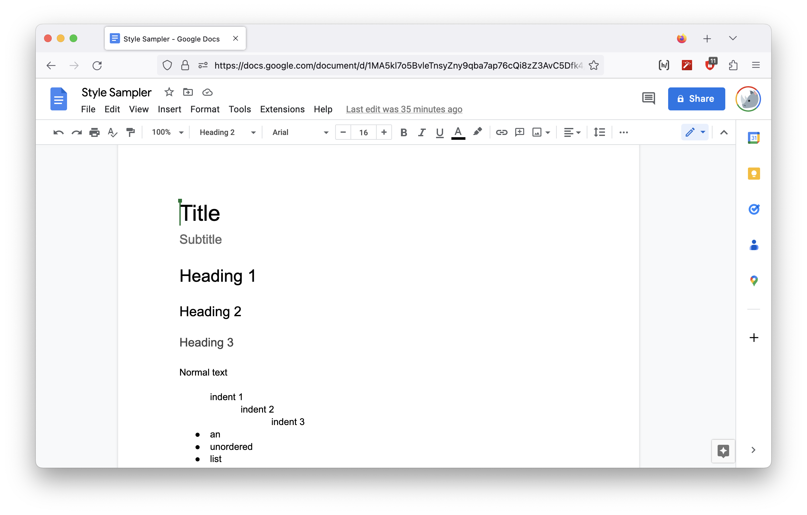
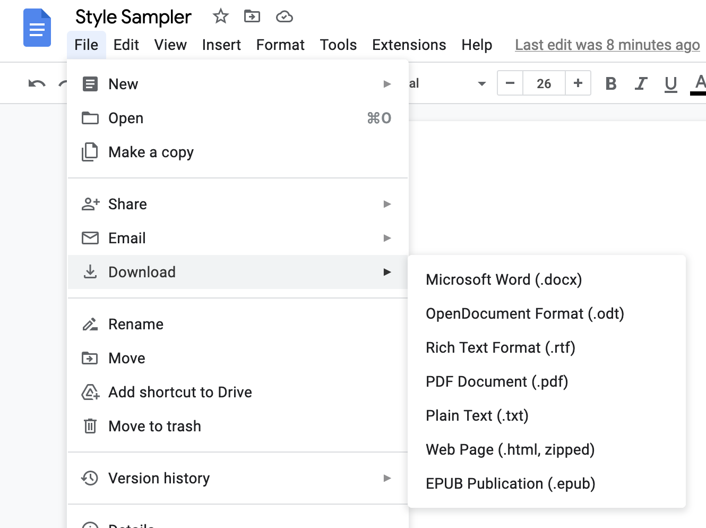

Here’s a style sampler page I made with Google Docs:

[Sampler Doc](https://docs.google.com/document/d/1MA5kl7o5BvleTnsyZny9qba7ap76cQi8zZ3AvC5Dfk4/edit#)

I basically just made an instance of every default class:

<figure>

</figure>

Here’s where you download the HTML version in Google Docs:

<figure>

</figure>

So you unzip that and you get [`StyleSampler.html`](StyleSampler.html), which looks about the same. But lets look at the code (I formatted indented the `HTML` in `VS Code` to be more readable): 

 
  <link rel="stylesheet" href="https://cdn.jsdelivr.net/gh/MarketingPipeline/Ace-Editor-Web-Component@v1.0.1/dist/ace-editor-wc.min.css">

<figure id=sampler-1>
<figcaption>The unchanged <code>HTML</code> from Google Docs</figcaption>
</figure>

